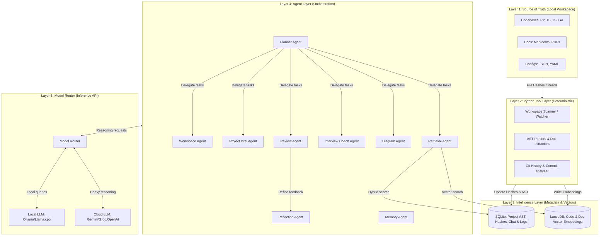
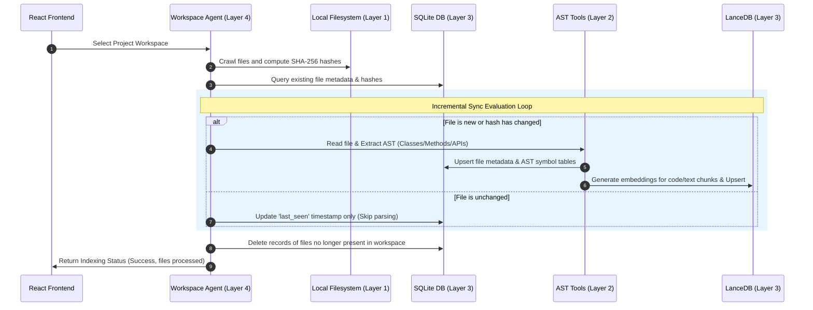
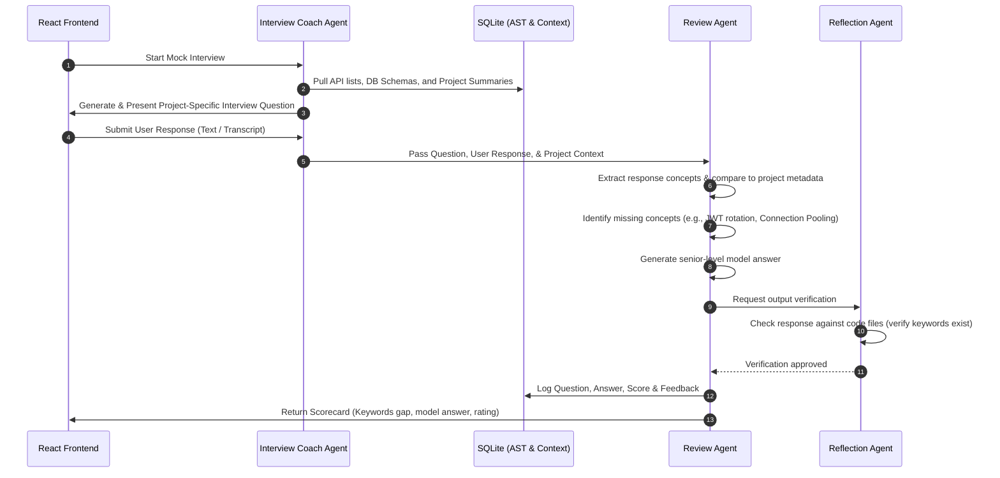
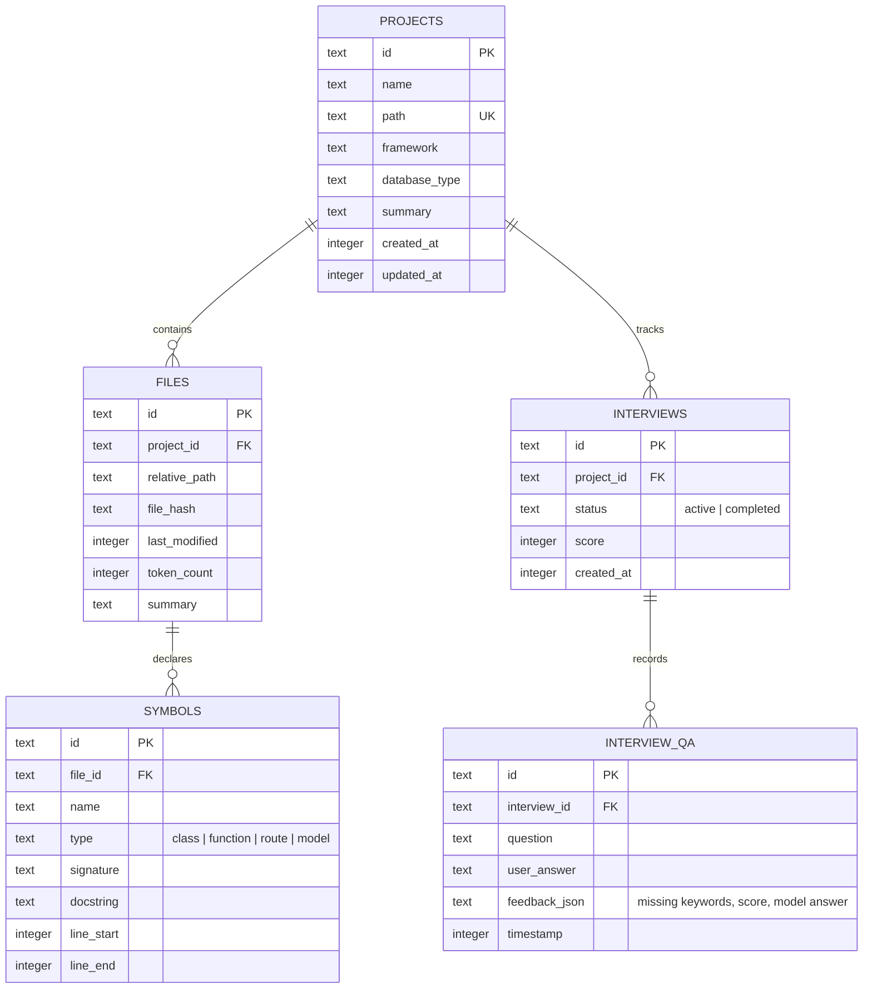

# Personal Engineering Intelligence System (PEIS) — Architecture Guide

This document describes the technical architecture, data flows, database schemas, and agent orchestration patterns for the **Personal Engineering Intelligence System (PEIS)**.

---

## 1. System Topology Overview

PEIS is structured into 5 logical layers to guarantee a local-first, privacy-respecting, and incremental engineering intelligence system.



---

## 2. Component Layer Detail

### Layer 1: Source of Truth (Local Filesystem)

The system treats the developer’s local disk as read-only. No operations within PEIS modify, rename, or write back to code or configuration files under analysis. Files are read on-demand to perform parsing or retrieval.

### Layer 2: Python Tool Layer

Designed to act as a **deterministic barrier** before invoking AI reasoning. LLMs do not scrape directories or grep code directly.

- **Workspace Scanner / Watcher**: Traverses the root paths, generates SHA-256 hashes of individual files, and compares them with the SQLite manifest.
- **AST Parsers**: Uses standard Python `ast` and package dependencies (like `tree-sitter` for JavaScript/TypeScript/Go) to construct a structured declaration tree containing exports, imports, classes, functions, routes, and DB models.
- **Document Extractor**: Converts PDFs, markdown, and config settings to cleaned, uniform text snippets.

### Layer 3: Intelligence Layer

The local derived cache that feeds agents context.

- **SQLite Storage**: Houses relational structures (e.g. which project owns which files, structural relationships of functions, schemas, schemas history, mock interview logs).
- **Vector DB (LanceDB)**: Zero-dependency, serverless vector store stored alongside SQLite, queryable with low latency. Houses chunks of code, documentation, and user conversational embeddings.

### Layer 4: Agent Layer

A swarm of specialized agents executing tasks behind a **Planner Agent**:

1.  **Planner Agent**: The main orchestrator. It receives user inputs, designs an execution plan (e.g. _Index_ -> _Retrieve_ -> _Answer_), triggers relevant agents, and builds the final response.
2.  **Workspace Agent**: Executes scans, change detection, and coordinates file watchers.
3.  **Project Intelligence Agent**: Analyzes AST mappings to understand framework patterns, database choices, endpoints, and trade-offs.
4.  **Retrieval Agent**: Connects vector search (LanceDB) and keyword search (SQLite FTS5) into a unified hybrid retrieval list.
5.  **Interview Coach Agent**: Selects project technical and behavioral concepts and produces interactive mock questions.
6.  **Diagram Agent**: Generates flowcharts and entity relationship definitions formatted as Mermaid.js source strings.
7.  **Review Agent**: Performs semantic matching on the user’s interview answers, lists missing keywords, and compiles scores.
8.  **Reflection Agent**: Audits the generated answers and reviews against the database mappings to ensure zero hallucinations.
9.  **Memory Agent**: Keeps track of context windows and summarizes past dialog.

### Layer 5: Model Router

An interface abstraction module. Depending on task complexity:

- **Intent classification / code chunk indexing** is routed to lightweight local models (e.g. Llama-3-8B-Instruct via Ollama/Groq).
- **Architecture analysis / mock interview generation** is routed to advanced models (e.g. Gemini 1.5 Pro, GPT-4o).

---

## 3. Core Workflows

### Workflow A: Hash-Based Incremental Indexing

Runs automatically when a project is selected or when the file watcher fires.



---

### Workflow B: Mock Interview and Keyword Evaluation

Handles interactive technical preparation.



---

## 4. Intelligence Layer Database Schema

Below is the SQLite relational schema that structures PEIS's derived intelligence.



### Vector Store Schema (LanceDB)

Stored in `storage/cache/vector_store.db` with the following columns:

- `id`: String (UUID)
- `project_id`: String (FK to PROJECTS)
- `file_id`: String (FK to FILES)
- `chunk_index`: Integer
- `content`: String (Source code chunk or clean text)
- `vector`: Float32 Array (Dimensions: 384 for local or 1536/3072 for cloud embeddings)
- `type`: String (`code` or `docs`)

---

## 5. Directory Mapping and Orchestration Pipeline

When the React frontend issues a query, it hits `backend/app/main.py` which passes control through the **Orchestration Pipeline**:

1.  **FastAPI Router (`app/api/`)**: Dispatches the request.
2.  **Service Layer (`app/services/`)**: Pulls DB connections, sets up vector stores, and loads configurations.
3.  **Planner (`app/orchestrator/planner.py`)**: Receives request data and maps instructions:
    ```python
    # Logic abstraction of the Planner Agent
    plan = {
        "steps": [
            {"agent": "retrieval_agent", "action": "hybrid_search", "args": {"query": query}},
            {"agent": "reflection_agent", "action": "validate_context"},
            {"agent": "review_agent", "action": "score_response"}
        ]
    }
    ```
4.  **Agent Invocation (`app/agents/`)**: Executes the list sequentially or in parallel.
5.  **Model Router (`app/orchestrator/model_router.py`)**: Formulates the prompt template from `llm/prompts/` and posts request payload to the designated local or remote model endpoint.
6.  **Response Builder (`app/orchestrator/response_builder.py`)**: Packages the response structure to send back to the frontend Client.

## Project Lifecycle section

User adds Workspace
│
▼
Workspace Scanner
│
▼
Project Detection
│
▼
Incremental Indexing
│
▼
Metadata Generation
│
▼
Embedding Generation
│
▼
Project Intelligence
│
▼
Ready for Chat
│
▼
Workspace Changes
│
▼
Incremental Refresh
