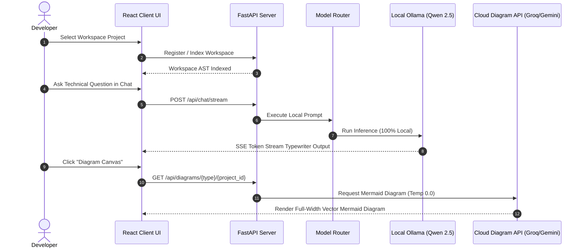

# Product Requirements Document (PRD)

# Personal Engineering Intelligence System (PEIS)

**Tagline:** *Your local, privacy-first AI engineering memory and mock interview coach.*

---

# 1. Executive Summary & Vision

Software engineers frequently work across multiple projects over months or years. As time passes, they naturally lose context around architecture, implementation details, database design, APIs, configuration, and engineering decisions they once made.

The **Personal Engineering Intelligence System (PEIS)** is a **local-first AI engineering assistant** designed to solve this problem.

Instead of duplicating projects, PEIS continuously understands and indexes the developer's local workspace, builds an intelligence layer over it, and acts as a long-term engineering memory.

Its primary goal is to help developers quickly regain project context, understand their own code, generate architecture insights, visualize system designs, and confidently explain projects during technical interviews.

---

## Problem Statement

Engineers often struggle to recall implementation details, design decisions, and architectural reasoning for projects they built months or years ago. Traditional documentation quickly becomes outdated, making interview preparation, project maintenance, and knowledge retrieval time-consuming. PEIS solves this by continuously building an intelligent understanding of the developer's local workspace and providing accurate, context-aware engineering assistance.

---

# 2. Target Audience

* Software Engineers preparing for technical interviews.
* Freelancers and Contractors managing multiple client codebases.
* Developers returning to older projects.
* Students preparing project demonstrations or placements.
* Engineers wanting a personal AI knowledge system for their local development workspace.

---

# 3. Core Features

## Feature 1 — Workspace Intelligence & Single-Pass Batch Indexing

PEIS continuously understands the developer's local workspace while avoiding unnecessary processing.

### Capabilities

* Incremental workspace scanning and directory change tracking
* SHA-256 based file change detection
* Automatic re-indexing of modified files only
* Multi-language project detection (Python, JS, TS, Go, Java, C++)
* **Single-Pass Batch AST Code Parsing**: Extracts functions, class definitions, imports, dependencies, API endpoints, and database models. JS/TS AST parsing (`ast_parser.js`) executes in a single batch pass with immediate V8 memory cleanup to preserve system RAM for local LLM inference.

---

## Feature 2 — Project Intelligence & Knowledge Generation

PEIS automatically understands projects and generates engineering knowledge.

### Generates

* Project Summary & Tech Stack Categorization
* Module Overview & Dependency Graph
* API Overview & Database Schema Map
* Folder Structure Understanding & Design Decisions
* Engineering Trade-offs & Implementation Notes

---

## Feature 3 — Progressive Learning Follow-up Questions

PEIS generates dynamic, codebase-specific progressive study questions after every technical explanation to help developers prepare for technical interviews.

---

## Feature 4 — Deterministic Architectural Diagram Canvas

PEIS provides an interactive visual canvas featuring responsive vector Mermaid.js diagrams.

### Capabilities & Tabs

* **Tab 1: Controller Sequence**: Traces overall request lifecycles from Frontend UI components to Backend Controllers, Services, and Storage.
* **Tab 2: Database Schema ER**: Renders a comprehensive, detailed Entity-Relationship schema containing all indexed model classes and fields.
* **Tab 3: Backend Routes Flow**: Displays a complete flowchart map of all backend API endpoints and handler components.
* **Deterministic Execution (`temperature: 0.0`)**: Cloud API keys (Gemini `gemini-1.5-flash` / Groq `llama-3.1-8b-instant`) are scoped exclusively to diagram generation at `temperature: 0.0` for 100% accurate outputs with zero fake/dummy diagrams.
* **AST-Driven Rate Limit Fallback**: If cloud rate limits (HTTP 429) occur, PEIS seamlessly generates a clean Mermaid diagram directly from local SQLite symbols.
* **Responsive Vector Viewport**: Auto-scales vector diagrams to fill 100% of the canvas with clear, legible text.

---

## Feature 5 — Strict Local-First Privacy Policy

* **100% Local Chat & RAG**: All chat messages, vector retrieval, and contextual explanations run strictly local via Ollama (`qwen2.5:3b`). Zero silent cloud API fallbacks exist for chat.
* **Ollama Cold-Boot Warmup & Auto-Retry**: Wakes Ollama when offline, runs a 1-token pre-flight warmup ping (`"hi"`), and preserves the full **`num_ctx: 8192`** memory context window.
* **Rolling Context Memory**: Keeps conversation logs capped at a rolling 20 messages per project in SQLite to maintain clean prompt payloads.

---

# 4. User Workflows

